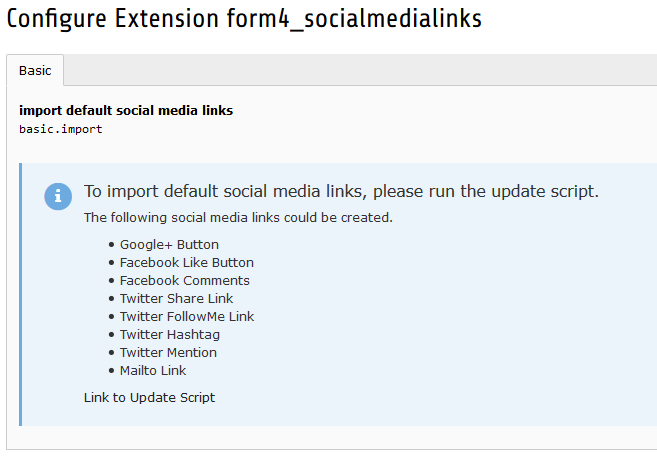
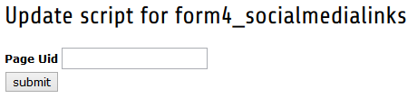
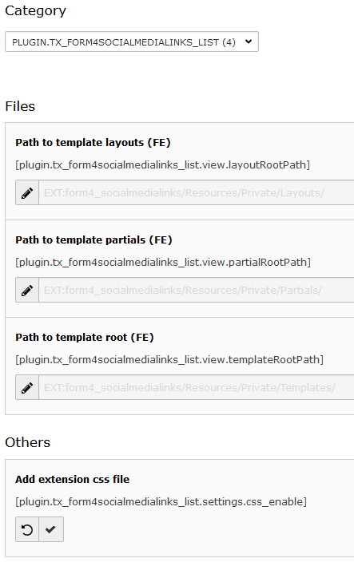

.. ==================================================
.. FOR YOUR INFORMATION
.. --------------------------------------------------
.. -*- coding: utf-8 -*- with BOM.

.. include:: ../Includes.txt

.. _admin-manual:

Administrator Manual
====================

Installation
------------

Install the extension with the extension manager.

Update Script
-------------

There is an Update Script to add the default social media links. It is optional to add them.

	Extension configuration

Add the page uid where the social media links should be created. It is recommended to use a sys_folder.

	Update Script

Template Constants
------------------

Add the static template to your extension template. There are the followin template constants.

	Template Constants

It is possible to use your own Fluid templates.

By default the extension does not use CSS, but you can configure to use a default CSS for the social media links.

