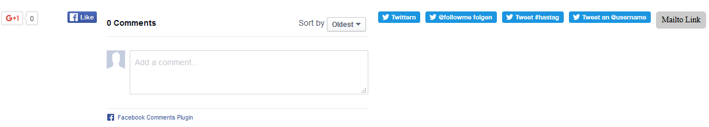

.. ==================================================
.. FOR YOUR INFORMATION
.. --------------------------------------------------
.. -*- coding: utf-8 -*- with BOM.

.. include:: ../Includes.txt

What does it do?
================

Social and share links as TYPO3 backend records (URL or small HTML). Output via content element or TypoScript; optional icons and placeholders (e.g. current page URL or title).

Features
--------

- Content element to show selectable social media links on a specific page
- Include global links for all pages via TypoScript (e.g. below page content or in a sidebar)
- Supports social services by URL (request) and script (widgets)
- For URLs you can set an image icon
- Extensible placeholder configuration: customize and extend the tokens dynamically replaced in the URL or script of a link

Screenshot
----------

	Default Social Media Elements
