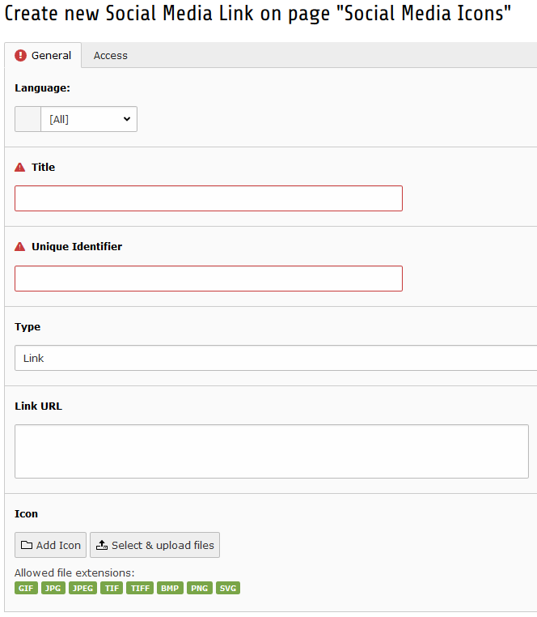
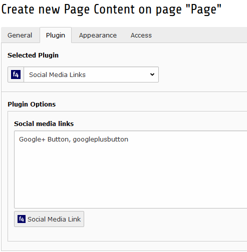

.. ==================================================
.. FOR YOUR INFORMATION
.. --------------------------------------------------
.. -*- coding: utf-8 -*- with BOM.

.. include:: ../Includes.txt

.. _users-manual:

Users manual
============

Adding a Social Media Link
--------------------------

- Select Web > List and select a page
- Select "Create new record" button on top of the list view
- Select "Social Media Link" item in the treelist

	Select "Social Media Link"

- Fill up the fields of the Social Media Link

	Select "Social Media Link"

Adding social media links to a page
-----------------------------------

- Add a new content element of type “Social Media Links”
- Configure the plugin: Select the social medial link items you want to render on the page

	Select "Social Media Link"
